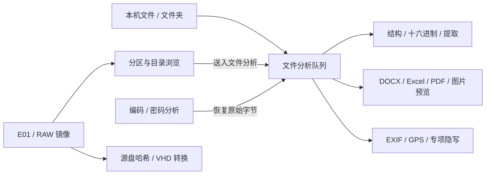

<div align="center">


# HexScope CTF

**让每一条隐藏线索，浮出表面。**

### Created by 是羊羊羊呀

离线隐写检查 · 密码分析 · 数字取证 · 文件预览


[下载免安装版](https://github.com/EvanYzl/HexScope-CTF/releases/latest) · [使用说明](使用说明.md) · [功能范围](题型覆盖与限制.md) · [提交问题](https://github.com/EvanYzl/HexScope-CTF/issues)

</div>

HexScope 是一款面向 CTF 隐写题、编码题和数字取证练习的中文桌面工作台。把文件拖进来，可以从文件结构、十六进制、元数据、像素、编码和密码等角度查找线索；镜像内提取的文件、密码分析恢复的字节，也可以回到同一个文件分析队列继续检查。

**Windows 便携版解压即可运行，无需安装 Python、Node.js、Java、Office 或额外运行环境。**程序的分析和预览在本机完成，运行组件、字体和解码资源随包内置。

## 快速开始

1. 打开 [Releases](https://github.com/EvanYzl/HexScope-CTF/releases/latest)，下载 `HexScope-CTF-4.1-GitHub-Windows-x64-Portable.zip`。
2. **完整解压**，进入目录，双击 `HexScope-CTF.exe`。移动到另一台电脑时请复制整个文件夹。
3. 拖入文件或文件夹，在左侧队列选择文件，切换右侧详情标签开始查看。
4. 先试试内置演示，或随包的 `示例文件`；每个示例目录都附有说明。

发布页同时提供源码 ZIP、独立 `HexScope.html` 和 SHA-256 校验清单。Windows 可使用以下命令检查下载文件，结果应与清单一致：

```powershell
Get-FileHash -Algorithm SHA256 .\HexScope-CTF-4.1-GitHub-Windows-x64-Portable.zip
```

## 功能一览

| 模块 | 可以做什么 |
|---|---|
| 批量文件分析 | 拖入文件/文件夹；文件树、精确大小、大小区间筛选与排序；比较真实文件签名和后缀。 |
| 十六进制与提取 | 查看头尾、容器终点、偏移与字符串；发现尾部附加数据；手动切片；单项导出或打包导出候选文件。 |
| EXIF / GPS | 查找相机、日期、注释、GPS、XMP、IPTC 等可识别标签；显示经纬度；查看原始值并导出 JSON。 |
| 图像与隐写 | 像素位平面、LSB 组合、PNG CRC/尺寸/调色板、ZIP 伪加密验证、双图差异、GIF/APNG 局部帧、零宽/空白字符等。 |
| 音频专项 | 支持范围内的整数 PCM WAV 波形、频谱、LSB、DTMF、倒放及声道差。 |
| 编码与密码 | Base64 等常用编码转换；78 个工具入口；有限预算的多层启发式分析、候选排序、转换路径、停止与报告导出。 |
| 取证镜像 | 内置 TSK / libewf，浏览分卷 E01、RAW/DD 等镜像的分区与文件目录；递归索引、大小筛选、提取与推送分析。 |
| 哈希校验 | 源盘解码数据流、本机文件、镜像内单个文件的 12 种哈希；HEX/Base64 表示、预期值比对及报告。 |
| VHD 与盘符 | 将 E01 解码数据转换为固定 VHD，使用 Windows 自带功能选择分区和盘符，只读挂载。 |
| 文件预览 | DOCX、Excel/CSV、PDF、常见图片、文本和部分音视频；镜像提取及密码恢复的文件共用预览入口。 |

### 文件预览

- **DOCX / DOCM：**正文、标题、列表、表格与内嵌图片，采用阅读重排视图。
- **XLSX / XLS / XLSM / XLSB / ODS / CSV / TSV：**切换工作表、分页、搜索，查看缓存值与公式文本。
- **PDF：**翻页、缩放、旋转、文本提取，常规加密 PDF 可输入密码后查看。
- **图片：**PNG、JPEG、GIF、BMP、WebP、AVIF、ICO 的原生预览、缩放与旋转。
- **文本及媒体：**中文编码切换；HTML/SVG 作为纯文本；部分音视频使用本地播放控件。

详细格式、资源限制和未支持的变体见 [文件预览说明](文件预览说明.md)。

### 模块之间如何配合



## 平台与边界

| 使用方式 | 支持情况 |
|---|---|
| Windows 10 1903+ / Windows 11 x64 | 完整便携版，内置桌面运行时与镜像引擎。 |
| 独立 `HexScope.html` | 可在支持所需 Web API 的现代浏览器中离线使用文件、隐写、密码和预览功能。 |
| macOS / Linux / Windows ARM | 没有对应原生发行包；可以尝试浏览器 HTML 版，兼容性未逐个平台实测。 |

原生 E01 引擎、完整流式哈希与盘符流程属于 Windows 便携版功能。VHD 转换需要接近源盘容量的额外磁盘空间；挂载/卸载请求管理员授权，不安装额外驱动。

“未检出”不等于不存在隐写，候选分不是正确率。现代密码通常需要密钥、弱参数或额外样本。DOCX 不保证原始 Word 分页和复杂布局；表格不重算公式；扫描 PDF 未内置 OCR；旧版 DOC、PPT/PPTX 和所有媒体编码尚未完整覆盖。

主文件队列单文件上限 128 MiB。Office 预览上限 32 MiB、PDF 64 MiB；表格每表前 2,000 行、100 列。其他预算和限制在对应说明中列出。

## 文档导航

| 文档 | 内容 |
|---|---|
| [使用说明](使用说明.md) | 从导入文件到导出线索的完整操作说明。 |
| [密码分析使用说明](密码分析使用说明.md) | 自动分析、题型工具、参数与结果回送。 |
| [题型覆盖与限制](题型覆盖与限制.md) | 自动分析适用范围、密钥/样本要求及高级变体边界。 |
| [镜像功能说明](镜像功能说明.md) | E01 / RAW、分区、目录、提取和推送。 |
| [哈希与盘符挂载说明](哈希与盘符挂载说明.md) | 源盘与容器哈希的区别、固定 VHD 和只读盘符。 |
| [文件预览说明](文件预览说明.md) | 支持格式、正文重排、分页和资源上限。 |
| [新增题型与示例](新增题型与示例.md) | 各专项隐写工具与演示向量。 |
| [验证记录](验证记录.md) | 测试范围、已确认结论及未验证部分。 |
| [更新记录](CHANGELOG.md) | 4.1 功能与本次署名发布说明。 |

## 从源码构建

下列环境只用于**开发与重建**，普通使用者无需安装。

开发测试采用 Windows x64、Node.js 22.13+（CI 模板使用 Node.js 24）。源码包含已构建的第三方浏览器库，因此单纯重建 HTML 不需要安装 npm 依赖：

```powershell
git clone https://github.com/EvanYzl/HexScope-CTF.git
cd HexScope-CTF
node HexScope-source/build.cjs
```

输出为仓库根目录的 `HexScope.html` 和 `HexScope.build.json`。运行完整自动化测试：

```powershell
cd HexScope-source
npm ci --ignore-scripts
npm test
```

完整测试包含 Windows 原生镜像组件；部分测试仅适用于 Windows。jsdom 和原生离屏 Canvas 是开发依赖，不是额外的用户运行环境。

生成 Windows 便携 ZIP 还需要开发用 Python 3.11+ 及对应版本的 Electron / TSK 官方归档；脚本会校验固定 SHA-256。见 [打包流程](HexScope-source/desktop/PACKAGING-CRYPTO.md)。密码与预览供应商库的可重复构建配置分别在 `crypto/vendor-build` 和 `preview/vendor-build`。

### 仓库结构

```text
HexScope-source/
├─ src/          文件分析、专项工具、镜像界面与中文页面
├─ crypto/       78 项密码工具、启发式搜索、Worker 与测试
├─ preview/      Office / PDF / 图片等离线预览组件
├─ desktop/      Electron、原生取证、哈希、VHD、图标与署名
├─ tests/        自动化测试与合成样本
├─ build.cjs     生成独立 HTML
└─ test-all.cjs  构建并运行完整回归
示例文件/         生成的演示数据与说明
验证/             发布验证摘要
.github/          中文问题模板
```

Windows CI 模板位于 `HexScope-source/desktop/windows-test.example.yml`，目前未启用 Actions。维护者获得 `workflow` 权限后，可将模板放入 `.github/workflows/windows-test.yml`；它在 Windows runner 上安装锁定的开发依赖并执行同一 `npm test`。

## 验证情况

本次发行对应 **462/462 项本地自动化测试通过**，包含原有文件/取证/密码能力，以及文件预览和跨模块联动。另使用包内 Electron，在 PATH 仅包含 Windows 系统目录的情况下复核密码工具、DOCX/Excel/PDF 解析、E01、哈希与 VHD 转换。

PDF 页面经过原生离屏 Canvas 绘制测试；**真实桌面窗口布局、原生拖放、全部图片/音视频编码、真实 UAC 与盘符挂载尚未完成实测**。这些边界不以 DOM 测试代替，详情见 [验证记录](验证记录.md)。

## 署名与组件

**Created by 是羊羊羊呀** · [GitHub @EvanYzl](https://github.com/EvanYzl)

软件首页、页脚、关于面板及便携版均保留项目署名；现有软件图标继续使用用户指定的图片。项目署名不替代第三方组件的原作者和版权声明。

第三方组件许可证、来源和必要的源码归档随仓库/便携包保留，见 [总声明](THIRD_PARTY_NOTICES.md)、[密码组件](密码模块第三方许可.md) 和 [预览组件](文件预览第三方许可.md)。原创项目部分目前未单独声明开源许可证。

欢迎通过 [Issues](https://github.com/EvanYzl/HexScope-CTF/issues) 反馈问题或建议；可复现步骤和不含隐私的最小样本更便于定位，详见 [贡献说明](CONTRIBUTING.md)。
